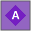
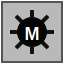
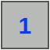
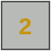
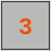
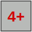

# Minesweeper Treasure Explorer

A small Godot 4 puzzle game that mixes classic Minesweeper with character movement.

Use limited Vision to reveal hidden tiles, read mine clue numbers, move across the map, collect bonus treasures, trade stats at altars, and reach the treasure to win.

## Play

Open the project in Godot 4 and run `Main.tscn`.

## Goal

Find the treasure and move onto its tile.

Revealing the treasure only shows its location. You still need enough Moves to physically reach it.

## Controls

- Reveal tile: click any hidden cell. Costs `1 Vision`.
- Move: arrow keys or `WASD`.
- Mouse move: click a revealed adjacent cell.
- Collect bonus treasure: stand on it and press `Enter`.
- Use altar: stand on an unused altar and press `Enter`.
- Restart: press `R`, or click `New Map`.

## Player Stats

- Moves: steps you can still take.
- Vision: reveal clicks you can still use.
- Defense: protection against stepping on mines.
- Unused points: bonus points used for altar stat exchange.

Initial stats:

- Moves: `15`
- Vision: `15`
- Defense: `3`

## Rules

- The map is `25 x 25`.
- The player starts at the center: `(12, 12)`.
- Clicking a mine reveals it safely and does not reduce Defense.
- Moving onto a mine reduces Defense by `1`.
- If Defense drops below `0`, you lose.
- If Moves reach `0`, you lose.
- Clicking a `0` clue expands nearby safe cells like classic Minesweeper.
- Bonus treasures give `1-3` unused points after you stand on them and press `Enter`.
- Altars are visible from the start and can each be used once.
- At an altar, you can trade Moves, Vision, Defense, and unused points.
- Rare arrows on blank cells point roughly toward the treasure.

## Symbols

| Image | Symbol | Meaning |
| --- | --- | --- |
|  | Hidden cell | Unknown tile. Click to reveal. |
|  | Revealed cell | Safe revealed floor. May show a clue number. |
|  | `P` | Player position. |
|  | `A` | Altar. Use once to exchange stats. |
|  | `T` | Treasure. Move here to win. |
|  | `B` | Bonus treasure. The number shows its point value. |
|  | `M` | Mine. Safe to reveal, dangerous to step on. |

## Clue Numbers

Clue numbers show how many mines are in the 8 surrounding cells.

| Image | Meaning |
| --- | --- |
|  | One nearby mine |
|  | Two nearby mines |
|  | Three nearby mines |
|  | Four or more nearby mines |

## Map Notes

- The map currently has `110` mines.
- The map currently has `24` bonus treasures.
- The treasure appears more than 16 movement steps from the center.
- Mines are spread across the map, with only a limited extra danger near the treasure.
