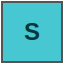

# Minesweeper Treasure Explorer

A Godot 4 prototype that combines classic Minesweeper logic with a moving character, limited vision clicks, limited movement, defense, one-use altars, bonus treasures, and a final treasure goal.

The player starts at the center of a 19 x 19 hidden map. Click hidden cells to spend Vision and reveal information like Minesweeper. Move the player through revealed or risky territory, collect bonus treasures for points, use altars to exchange stats, and physically reach the treasure cell to win.

## How To Run

Open this folder in Godot 4 and run `Main.tscn`.

## Controls

- Reveal: click any hidden cell. This costs 1 Vision.
- Move: arrow keys or `WASD`.
- Mouse move: click a revealed adjacent cell.
- Open altar: stand on an unused altar and press `Enter`.
- Collect bonus treasure: stand on it and press `Enter`.
- Apply altar build and exit: press `Enter` again, or click `Apply`.
- Restart: press `R`, or click `New Map`.

## Goal

Find the treasure and move onto its tile.

Vision can reveal the treasure location, but revealing it does not win the game. The player must spend Moves and physically reach the treasure cell.

## Core Rules

- The map is 19 x 19.
- The player starts at `(9, 9)`.
- The treasure spawns on a random edge cell.
- The map contains mines, treasure, altars, and bonus treasures.
- Clicking a hidden cell costs 1 Vision.
- Moving 1 cell costs 1 Move.
- If Moves reach 0, the game ends in defeat.
- If Vision reaches 0, the player cannot reveal more hidden cells until gaining or exchanging for more Vision.
- Clicking a mine reveals that mine, but does not reduce Defense.
- Moving onto a mine reduces Defense by 1.
- If Defense falls below 0, the game ends in defeat.
- Moving onto a bonus treasure reveals that it can be collected.
- Pressing `Enter` while standing on a bonus treasure grants unused points and removes the treasure from the map.
- Moving onto an unused altar lets the player reallocate stats.
- Each altar can be used once.
- All altar locations are visible from the start.

## Minesweeper Reveal

Revealed normal cells show a clue number. The number tells how many mines are in the 8 surrounding cells.

If the clicked cell has 0 surrounding mines, the game expands the reveal automatically, like classic Minesweeper. Nearby safe cells and border clue numbers are opened together.

Special cells such as treasure, altars, and bonus treasures can be revealed by Vision, but their effects require movement or interaction:

- Revealed treasure: shows the target location.
- Revealed bonus treasure: shows where to move, then press `Enter`, for points.
- Revealed altar: shows where to move for stat exchange.
- Revealed mine: shows a dangerous cell that costs Defense only if stepped on.

## Player Stats

- Moves: remaining movement steps.
- Vision: remaining reveal clicks.
- Defense: mine-hit protection while moving.
- Unused points: bonus treasure points that can be spent at altars.
- Exchange budget: the value of current stats plus unused points.

Initial stats:

- Moves: 15
- Vision: 15
- Defense: 3

## Altars

Altars use the existing exchange-budget system. You can reduce stats you already have and move that value into other stats.

For example, even with 0 unused points, you can lower Defense and use that budget to increase Vision or Moves.

Stat costs:

- Defense: 1 budget per point
- Vision: every 5 vision clicks costs 1 budget, and altar changes happen in units of 5
- Moves: every 5 moves costs 1 budget

Each altar can only be used once. After applying a build, that altar becomes inactive.

## Bonus Treasures

Bonus treasures are extra collectible rewards on the map. They are more common than before, and each gives 1-3 unused points when the player stands on the tile and presses `Enter`.

Unused points can be spent at altars together with the value of the player's current stats.

## Map Symbols And Visuals

The prototype uses program-drawn icons. The README images below match the current visual language.

| Image | Element | Meaning |
| --- | --- | --- |
|  | Hidden cell | An unexplored tile. Click it to spend Vision and reveal it. |
|  | Revealed normal cell | A revealed floor tile. It may show a mine clue number. |
|  | Start cell | The center spawn area. The player starts at `(9, 9)`. |
|  | Player | The blue `P` marker shows the current player position. |
|  | Altar | The purple diamond `A`. Move onto it and press `Enter` to reallocate stats. |
|  | Treasure | The gold star `T`. Move onto it to win. |
|  | Bonus treasure | The green `B` shows its point value underneath. Move onto it and press `Enter` to gain those unused points. |
|  | Mine | The black `M`. Clicking reveals it safely; moving onto it costs Defense. |

## Clue Number Textures

Clue numbers appear on revealed normal cells. They tell you how many mines are in the 8 surrounding cells.

| Image | Number | Meaning |
| --- | --- | --- |
|  | `1` | Low danger. One nearby mine. |
|  | `2` | Medium danger. Two nearby mines. |
|  | `3` | High danger. Three nearby mines. |
|  | `4+` | Very high danger. Four or more nearby mines. |

Some revealed blank cells may show an arrow (`^`, `v`, `<`, or `>`). These arrows are sparse hints that point in the rough direction of the treasure. They are guidance hints, not movement commands.

## Map Generation

- The game creates a mine-free route from the start to the treasure to avoid impossible maps.
- The map currently generates 68 mines.
- The treasure appears on the map edge.
- More mines are placed around the treasure area.
- Bonus treasures are placed across the map to give the player more altar-exchange points.
- The map currently generates 16 altars.
- The map currently generates 26 bonus treasures.
- Some revealed blank safe cells can show sparse arrows pointing toward the rough treasure direction.
- Altars are distributed by map regions for a more even spread, and each can be used once.

## Current Prototype Scope

This prototype uses simple program-drawn shapes instead of final art assets. The focus is on testing the hybrid rules: Minesweeper-style reveals, player movement, mine defense, bonus points, one-use altars, and treasure victory.
