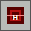

# Minesweeper Exploration RPG

A 2D strategy exploration game made in Godot 4. The game combines minesweeper-style clues, grid movement, resource management, combat risk, and stat reallocation.

You begin at the center of a 19 x 19 map. Most of the map is hidden. Move through the grid, read clue numbers, fight enemies when necessary, use altars to rebuild your stats, and reach the treasure on the edge of the map before your moves run out.

## How To Run

Open this folder in Godot 4 and run `Main.tscn`.

## Controls

- Move: arrow keys or `WASD`
- Mouse move: click an adjacent grid cell
- Open altar: stand on an altar and press `Enter`
- Apply altar build and exit: press `Enter` again, or click `Apply`
- Restart: press `R`, or click `New Map`

## Goal

Find the treasure on the edge of the map and defeat the Treasure Guard.

The Treasure Guard has 20 power. If your power is lower than 20 when you enter the treasure cell, you lose. If your power is at least 20, you win.

## Core Rules

- The map is 19 x 19.
- The player starts at `(9, 9)`.
- The treasure spawns on a random edge cell.
- Moving 1 cell costs 1 move.
- If moves reach 0, the game ends in defeat.
- Revealed normal cells show minesweeper-style clue numbers.
- A clue number tells you how many enemies are in the 8 surrounding cells.
- Clue numbers count enemies only. They do not count altars, treasure, or the player.
- Enemies inside your revealed vision area show their icon and power.

## Player Stats

- Power: decides whether you can defeat an enemy.
- Defense: decreases by 1 after each enemy you defeat.
- Vision: controls which nearby cells are revealed.
- Moves: your remaining movement resource.
- Unused points: reward points that have not been converted into stats.
- Exchange budget: the value of your current stats plus unused points.

## Combat

When you enter an enemy cell:

- If your power is lower than the enemy power, you lose.
- If your power is equal to or higher than the enemy power, you defeat the enemy.
- Defeating an enemy gives reward points based on enemy level.
- Defeating an enemy reduces defense by 1.
- If defense falls below 0, you lose.

## Altars

Altars are visible from the start.

At an altar, you can reallocate your current build. This is not just spending new reward points. You can reduce stats you already have and move that value into other stats.

For example, even with 0 unused points, you can lower Power and use the released budget to increase Defense, Vision, or Moves.

Stat costs:

- Power: 1 budget per point
- Defense: 1 budget per point
- Vision: starts at 4; each +1 costs 2 budget
- Moves: every 5 moves costs 1 budget

If a new build costs more than your exchange budget, the input will not increase. You can still reduce stats to free budget.

## Map Symbols And Visuals

The prototype uses program-drawn icons. The README images below match the current in-game visual language.

| Image | Element | Meaning |
| --- | --- | --- |
|  | Hidden cell | An unexplored tile. Its contents are unknown. |
|  | Revealed normal cell | A safe revealed floor tile. It can show a clue number. |
|  | Start cell | The center spawn area. The player starts at `(9, 9)`. |
|  | Player | The blue `P` marker shows the current player position. |
|  | Altar | The purple diamond `A`. Stand on it and press `Enter` to reallocate stats. |
|  | Treasure | The gold star `T`. This is the final goal on the map edge. |

## Clue Number Textures

Clue numbers appear on revealed normal cells. They tell you how many enemies are in the 8 surrounding cells.

| Image | Number | Meaning |
| --- | --- | --- |
|  | `1` | Low danger. One nearby enemy. |
|  | `2` | Medium danger. Two nearby enemies. |
|  | `3` | High danger. Three nearby enemies. |
|  | `4+` | Very high danger. Four or more nearby enemies. |

## Enemy Icons

Enemies use different shapes, colors, letters, power ranges, and rewards.

| Image | Enemy | Letter | Power | Reward | Texture Explanation |
| --- | --- | --- | ---: | ---: | --- |
|  | Lesser Foe | `e` | 2-4 | 1 | Small light-red circle. This is the safest enemy type and is common near the center and altars. |
|  | Foe | `E` | 5-7 | 2 | Red circle with a white ring. A basic early-game combat target. |
|  | Bandit | `B` | 8-10 | 3 | Orange-red triangle with a white slash. A mid-level threat. |
|  | Raider | `R` | 11-13 | 5 | Dark-red diamond with a cross. A stronger enemy that gives a better reward. |
|  | Armored Foe | `H` | 14-16 | 7 | Dark-red square armor icon. It represents a durable late-game enemy. |
|  | Elite Foe | `X` | 17-19 | 9-10 | Black-red hexagon with a red ring. One of the most dangerous normal enemies. |
|  | Treasure Guard | `G` | 20 | 0 | Black crown with a gold base. It guards the treasure and must be defeated to win. |

The side panel contains an Enemy Key that shows each icon, power range, and reward.

## Map Generation

- The game creates a hidden route from the start to the treasure to avoid impossible maps.
- Around 112 enemies are generated by default.
- Enemy strength generally increases with distance from the center.
- Low-level enemies are more common near the center and around altars.
- Some low-level enemies can appear in route and altar-adjacent safety areas.
- The treasure area is more dangerous than the center.

## Current Prototype Scope

This prototype uses simple program-drawn shapes instead of external art assets. The focus is on testing the game rules, map generation, combat, movement pressure, clue reading, and altar stat exchange.
